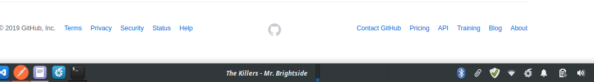

# XFCE Spotify Plugin

This plugin integrates Spotify's Now Playing feature with XFCE Panel.

This is excellent to use when you use the Spotify Webapp, because you will always know what song is playing without switching between tabs.

and by the way, it looks cool :)

## Features

- Shows the current song playing.
- If you hover over the name, you will see the album
- If you click the name, you will be redirected to the Spotify song in the browser.
- Progress bar of the song.

## What are the requirements for this?

- XFCE
- [XFCE Plugin: Genmon (Generic Monitor)](https://goodies.xfce.org/projects/panel-plugins/xfce4-genmon-plugin)
- Jq (sudo apt install jq)
- CURL

For Linux Mint, you can download Genmon from the software manager.

## Installation

### Getting the Spotify Access Token
1. Create a Spotify App in your [Spotify developer account](https://developer.spotify.com/dashboard/)
2. Make it ask for these permissions:
    - user-read-playback-state
    - user-read-currently-playing
3. Follow [Spotify's OAuth guide](https://developer.spotify.com/documentation/general/guides/authorization-guide/)
4. Follow the OAuth flow until you get an Access Token and the Refresh Token

### Installing this plugin
1. Download/Clone this repo
2. Put your configuration in the config.sh file, for this you will need an access_token, a refresh_token and an Auth Header
    
    - **ACCESSTOKEN**: This is the Access Token you got from the OAuth process described before

    - **REFRESHTOKEN**: This is the Refresh Token you got from the OAuth process described before

    - **AUTHHEADER**: Base 64 encoded string containing the basic authorization for your app. Example: base64(clientid:clientsecret)

3. Create a genmo item in your taskbar
4. Configure this genmo item to execute the file xfce-spotify-main.sh, hide the label and set a period of 10 seconds
5. Enjoy

## F.A.Q

### **Does this plugin show real time info?**

*Technically* it doesn't, but it refreshes every 10 seconds (you can even lower down this number in the genmo settings) so it emulates being in real time

### **But I want real time info about the current playing song, I will lower down the refresh time to 1 second...**

Hold on buddy, It's not that easy, Spotify has a requests limit (actually unknown) per Application/Hour. So *you can* lower down this number, but the plugin probably will stop working after a while.

### **I don't like the progress bar (or any other element), can I remove it?**

Yes sure, just comment one line and it will be done. Go to xfce-spotify-main.sh and comment these lines:

    Line 33 - Song information
    Line 34 - Album information when hovering
    Line 35 - Progress Bar
    Line 36 - Song Link

## Credits

- Genmo for making this possible and very easy to code, you are awesome!
- All the StackOverflow community with their answers